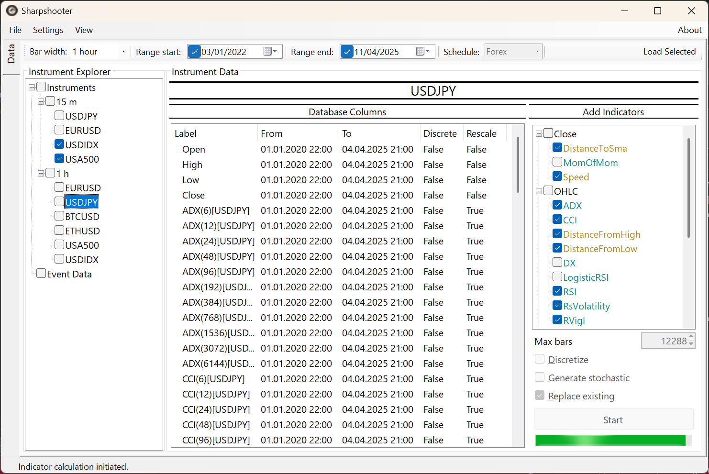
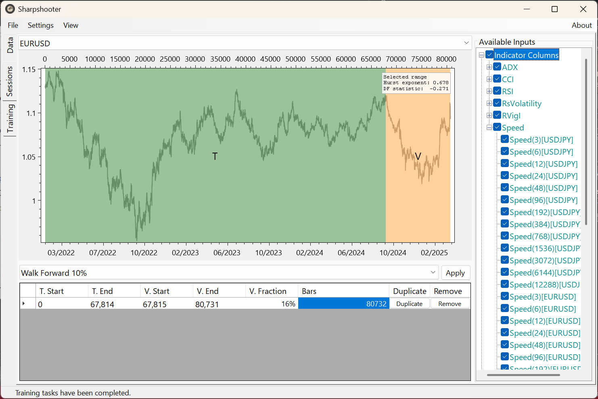
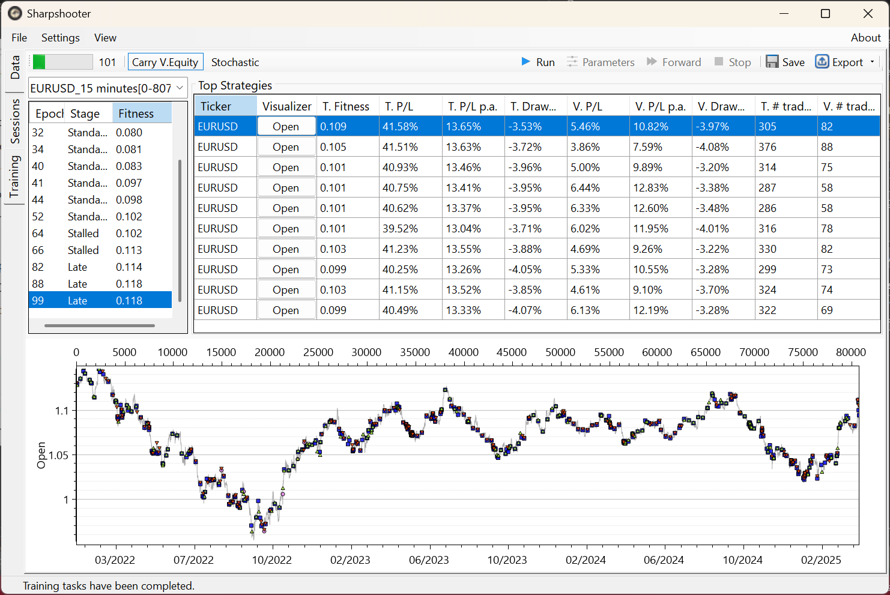
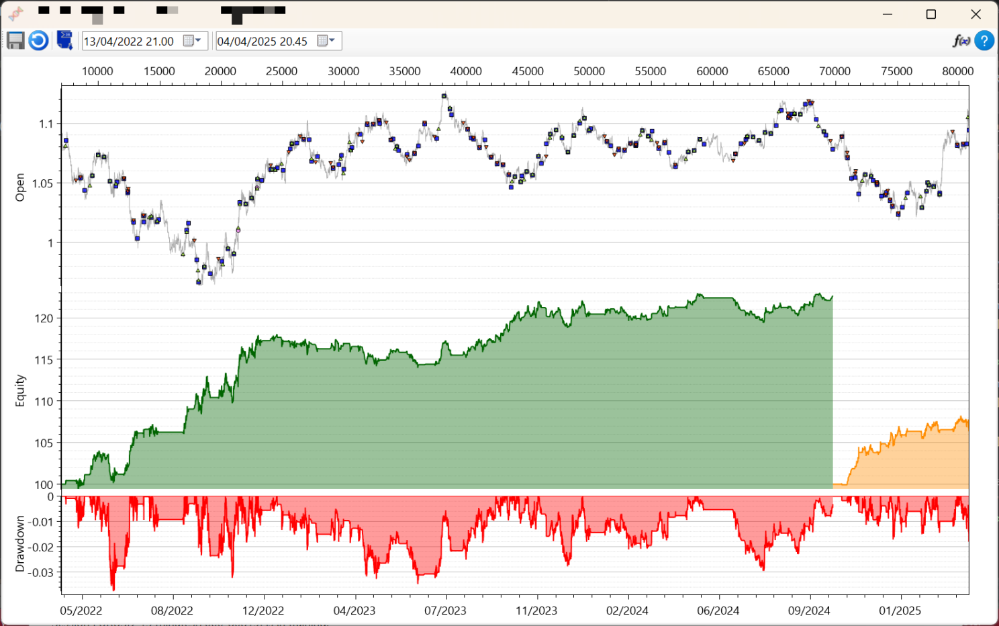
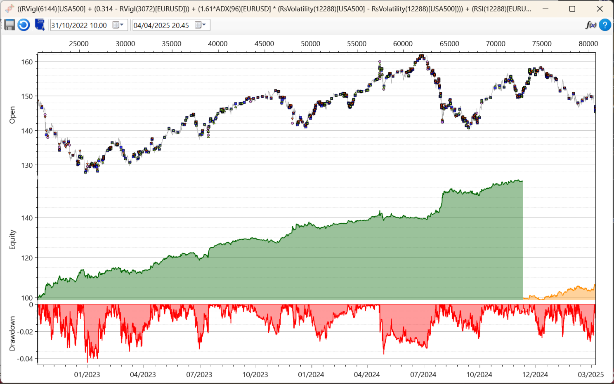

# Sharpshooter & SharpTrader
This article provides supplementary information on my two trading-related personal software projects. I will refer to this page in posts to avoid duplicating content. Content is subject to be updated as I further develop the software. For transparency, I will maintain log of changes made due to correction of factual errors or sources of possible misinterpretation if any such should appear. 

Changes to this document since its release:
- 9th Nov 2025: Updated the lists of features to reflect recent improvements. Note: screenshots have not been updated to reflect recent changes.
- 2nd Jan 2026: Demonstration video.

## Ease of use
- Highly responsive and streamlined Windows UX.
- Settings can be stored as profiles for different purposes.
- Online reference through tooltips.
- Experimental: 'Headless' API to use functionality of the software programmatically, i.e., without graphical interface.

## Strategy discovery & optimization engine
- Custom genetic programming (GP) engine specifically designed for trading strategy discovery.
- Dynamically compiles strategies into machine code for fast evaluation of large data sets.
- Multitargeting: evaluate strategy performance against multiple target instruments simultaneously. GP target in such cases is to maximize the total/average performance (find strategies that perform well on all included instruments). Multitargeting is distinct from using indicators from several instruments to trade one instrument.
- Supplemented automatically with standard numerical optimization.
- Upcoming: volatility trading strategies.
- Upcoming: develop strategies for composite instruments like spreads (currently possible manually by importing externally calculated composite quotes).

## Market data
- Import timestamped OHLC quotes from CSV into built-in database. A set of CSV files can be imported from a zip archive.
- Imported data is by default normalized against applicable market trading schedule.
- Built-in database utilizes highly efficient compression.
- Resample data to lower frequency (greater bar width).
- Invert instrument (e.g. EURUSD to USDEUR).
- Experimental: incremental updates to data sets.

## Built-in indicators
- Common indicators have been implemented and cross-verified to match R package 'TTR'.
- Some additional elementary 'indicators'.
- Plotting of indicator values.
- Values of externally calculated indicators can be imported alongside quote data.
- Experimental: integer-valued indicators and discrete trading logic.

## Backtesting
- Data ranges can be drawn, generated programmatically from presets, or entered manually.
- Fitness functions: parametrized equity fitness is infinitely adjustable in regards to drawdown and the total number of open bars. It's superior due to adjustability and I use it exclusively, but there are also a few other typical options.
- Can process candles of 1 min and up. Recommendation: bar widths between 15 min and 1 hr are currently most suitable. Using short bars does not reduce the need to have training data over substantial time period, typically several years. Likewise, indicators should cover substantial absolute range in time. Hence, bar widths below 15 min require greater computing resources without guaranteed gains in strategy performance. The software can easily handle many years of training data based on 1 hr bars. There is no need to compromise by reducing resolution below 1 hr.
- Adjustable allocation.
- Cost modeling based on static spread cost.
- Closing of positions before weekends.
- Upcoming: dynamic spread cost.

## Visualizations, statistics, reporting
- Zoomable plots of executed transactions, equity, drawdown. OHLC candles are displayed on high time resolution plots.
- Tables can be copied to Excel with formatting through the clipboard.
- Plots can be exported to an image file or copied to the clipboard.
- Plotting is based on OxyPlot library.
- Summary statistics for long/short/all trades, histogram of return distribution.
- Exportable trade log.
- Basic HTML reporting.

## Extensibility SDK
- Implement and load custom indicators and fitness functions. Custom parameters can added for both and accessed through Sharpshooter user interface without UX development (i.e., Sharpshooter will create editing controls for such automatically).
- Add custom trading calendars.
- Add fully custom data sources, including online ones (WebAPIs).
- Extensions are developed in Visual Studio against base types and interfaces that are found in the SDK (NuGet package). Custom types are compiled into a standard .Net assembly (DLL file) that can be loaded into Sharpshooter dynamically.
- A single DLL can contain an unlimited number of extensions of all types. Multiple DLLs can be loaded, either through user action or by placing them into a special folder for automatic loading.
- Compatibility guard: Sharpshooter ensures that extensions have been developed with sufficiently recent SDK version. It is unlikely that extensibility API will change frequently, hence compatibility issues are unlikely to be frequent.
- Types have regular type documentation. Apart from data source extensions, the current type reference is most likely sufficient for experienced .Net developers, but SDK examples are in preparation. 

## SharpTrader (beta)
SharpTrader is the automatic strategy execution agent for Sharpshooter.
- Operates against Interactive Brokers (IBkr) low-level API. SharpTrader SDK enables adding API     clients for other brokerages.
- Multi-threaded real-time architecture capable of handling large volumes of real-time market data and multiple strategies.
- Standard method of adding strategies is save them into a file in Sharpshooter. SharpTrader can later load selected strategies from such files. The SDK enables execution of custom strategies that do not originate from Sharpshooter.
- Aware of the market schedule. Strategies are suspended before market weekend and other closures.  Additional user-defined suspensions before, e.g., major announcements are also possible.
- Synchronization guard: checks accuracy of system time by using Network Time Protocol before starting.
- Minimalist user interface as account and transactions can be monitored from IBkr Trader Workstation (TWS) software.

# Screenshots
All results shown are calculated non-leveraged with static allocation (100% of the initial equity). The spread cost is accounted for at the level typical for retail trading. Quotes used are bid quotes from (Dukascopy)[https://www.dukascopy.com/swiss/english/marketwatch/historical/]. Timestamps are UTC.

# Examples with trade log
All results shown are calculated non-leveraged with static allocation (100% of the initial equity). The spread cost is accounted for at the level typical for retail trading. Quotes used are bid quotes from (Dukascopy)[https://www.dukascopy.com/swiss/english/marketwatch/historical/]. Timestamps are UTC.

USDJPY15m/I trade log: [Strategy1Trades.csv](logs/Strategy1Trades.csv)

# Video example
At [YouTube](https://www.youtube.com/watch?v=IA46KOJuJ_g).